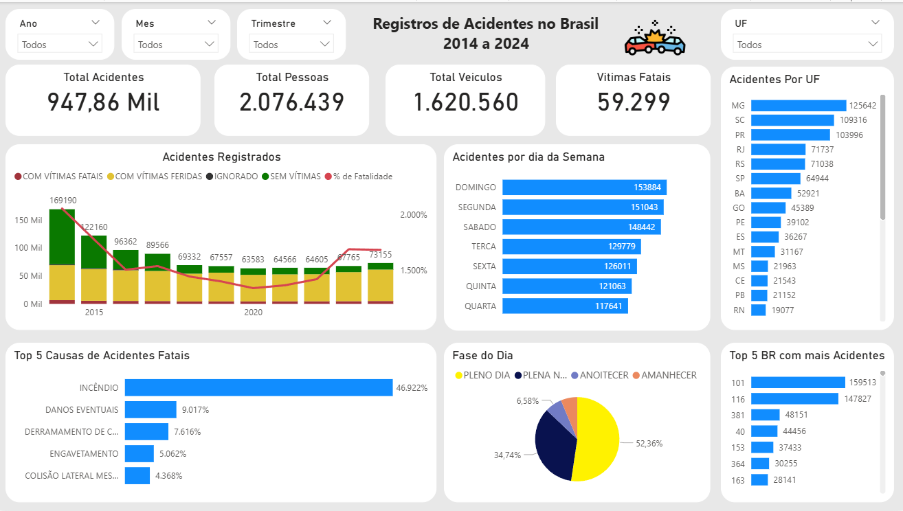
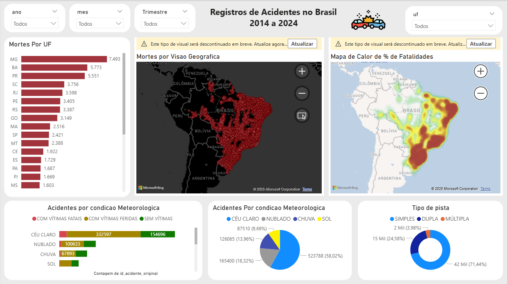
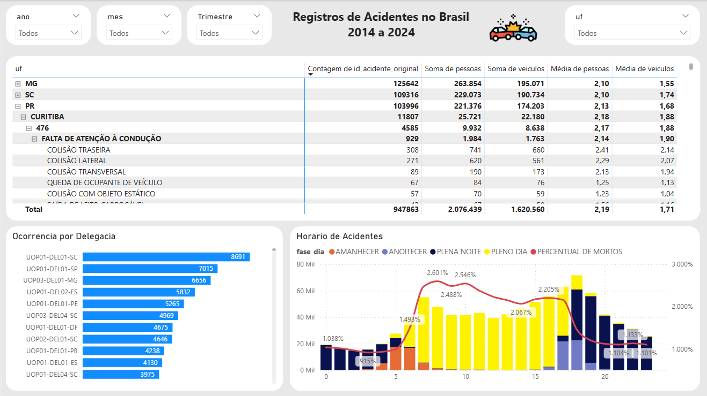

# 🚀 Pipeline de Dados End-to-End: Acidentes em Rodovias Brasileiras

Este projeto é um pipeline de dados completo de nível de portfólio que ingere, processa e modela dados de acidentes rodoviários do Brasil (fonte: Kaggle) para análise em BI.

O pipeline é 100% open-source e orquestrado usando Docker.

## 📊 Dashboard Final (Power BI)

## 🛠️ Stack de Ferramentas

* **Orquestração de Infra:** Docker & Docker Compose
* **Ingestão (Fase 1):** Apache NiFi
* **Data Lake (Camadas Bronze/Silver):** MinIO (S3-compatible)
* **Processamento/Transformação (Fases 2 e 3):** Apache Spark (PySpark)
* **Data Warehouse (Camada Gold):** PostgreSQL
* **Orquestração de Pipeline (Fase 4):** Apache Airflow
* **Visualização (Fase 5):** Power BI

## 🔧 Como Executar

1.  Clone este repositório.
2.  Certifique-se de ter o Docker Desktop instalado.
3.  Baixe o conjunto de dados do Kaggle (https://www.kaggle.com/datasets/alinebertolani/federal-highway-accidents-dataset) e coloque o CSV na pasta `./landing_zone/`.
4.  Na raiz do projeto, execute: `docker-compose up -d --build`.
5.  Acesse o Airflow em `http://localhost:8080` e dispare a DAG `pipeline_acidentes_brasil`.
6.  Conecte o arquivo `.pbix` ao banco PostgreSQL em `localhost:5432`.